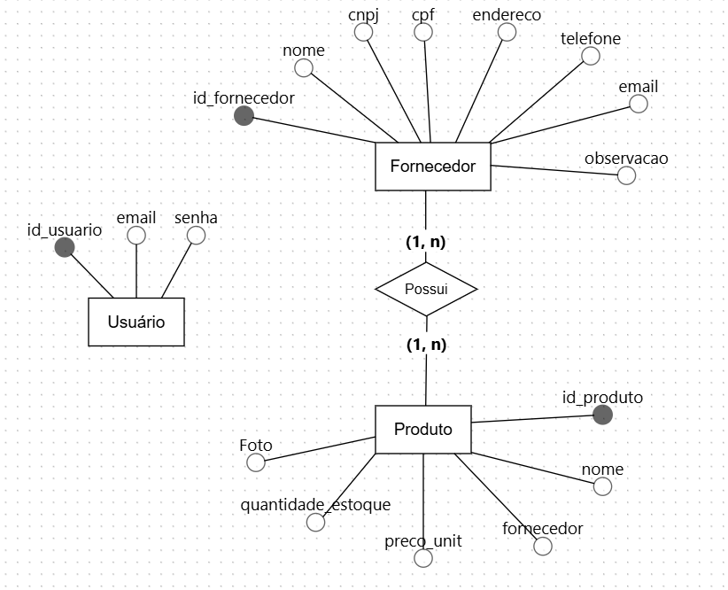
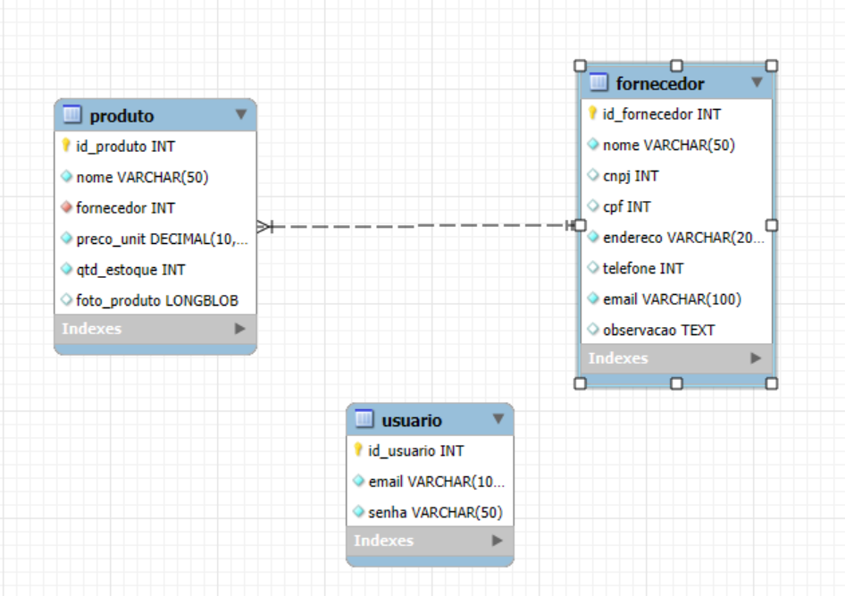

# ✨ PeçaRara Brechó – Sistema de Gestão  

Este repositório contém o **front-end** e a **estrutura de banco de dados** do sistema **PeçaRara Brechó**, uma aplicação web responsiva para gerenciamento de **fornecedores**, **produtos** e **usuários**.  
O sistema foi projetado para funcionar tanto em **desktop** quanto em **dispositivos móveis**, garantindo uma experiência consistente e intuitiva.  

---

## 📑 Sumário
- [📌 Funcionalidades](#-funcionalidades)
- [🗄️ Estrutura do Banco de Dados](#️-estrutura-do-banco-de-dados)
- [🖼️ Modelos](#-modelos)
- [📱 Responsividade](#-responsividade)
- [🛠️ Tecnologias Utilizadas](#-tecnologias-utilizadas)
- [⚙️ Como Usar](#️-como-usar)
- [🖼️ Link Para o Protótipo do Figma](#-link-para-o-protótipo-do-figma)

---

## 📌 Funcionalidades  

### 🔑 Login de Usuário  
- Tela inicial com autenticação via **e-mail** e **senha**.  
- Controle de acesso armazenado na tabela `usuario`.  

### 🏠 Dashboard Principal  
Menu com as opções:  
- 📇 **Cadastro de Fornecedores**  
- 📦 **Cadastro de Produtos**  
- 📋 **Listagem de Produtos**  
- 🚪 **Logout (Sair)**  

### 📇 Cadastro de Fornecedores  
Formulário para inserir:  
- Nome  
- CNPJ ou CPF  
- Endereço  
- Telefone  
- E-mail  
- Observações  

➡️ Listagem abaixo do formulário mostrando os fornecedores cadastrados.  

### 📦 Cadastro de Produtos  
Formulário para inserir:  
- Nome  
- Código (ID gerado automaticamente)  
- Quantidade em Estoque  
- Preço Unitário  
- Fornecedor *(relacionado à tabela de fornecedores)*  
- Foto do Produto *(opcional)*  

➡️ Listagem abaixo do formulário mostrando os produtos cadastrados.  

### 📋 Listagem de Produtos  
Tabela com:  
- **ID**  
- **Nome**  
- **Descrição**  
- **Preço Unitário**  
- **Fornecedor**  
- **Ações** *(Editar / Excluir)*  

---

## 🗄️ Estrutura do Banco de Dados  

O banco **peca_rara_db** foi modelado em 3 tabelas principais:  

### 📇 Tabela **Fornecedor**
- `id_fornecedor` *(PK)*  
- `nome` *(obrigatório)*  
- `cnpj` *(opcional)*  
- `cpf` *(opcional)*  
- `endereco` *(obrigatório)*  
- `telefone` *(opcional)*  
- `email` *(obrigatório)*  
- `observacao` *(opcional)*  

### 👤 Tabela **Usuário**
- `id_usuario` *(PK)*  
- `email` *(único e obrigatório)*  
- `senha` *(obrigatório)*  

### 📦 Tabela **Produto**
- `id_produto` *(PK)*  
- `nome` *(obrigatório)*  
- `fornecedor` *(FK de id_fornecedor)*  
- `preco_unit` *(decimal, obrigatório)*  
- `qtd_estoque` *(obrigatório)*  
- `foto_produto` *(opcional)*  

📖 O **Dicionário de Dados** com os tipos, tamanhos e obrigatoriedade de cada campo encontra-se no arquivo [`Dicionário de dados.pdf`](./Dicionário%20de%20dados.pdf).  

---

## 🖼️ Modelos  

**Modelo Conceitual**  
  
**Modelo Lógico**  

Esses diagramas representam visualmente as entidades, atributos e relacionamentos do sistema.  

---

## 📱 Responsividade  

O sistema é **totalmente responsivo** e se adapta automaticamente a diferentes tamanhos de tela:  

- 🖥️ **Desktop**: formulários e listagens em formato amplo, aproveitando todo o espaço horizontal.  
- 📱 **Mobile**: formulários e listagens reorganizados verticalmente, facilitando a navegação em telas menores.  

---

## 🛠️ Tecnologias Utilizadas  

- **HTML5** e **CSS3**  
- **Flexbox** para layout responsivo  
- **MySQL** para o banco de dados relacional  
- Prototipagem via **Figma**  
- Documentação via **Microsoft Word**  

---

## ⚙️ Como Usar  

1. Baixe os arquivos do repositório.  
2. Importe os scripts SQL (`peca_rara_db_fornecedor.sql`, `peca_rara_db_produto.sql`, `peca_rara_db_usuario.sql`) no **MySQL**.  
3. Execute o arquivo da tela de login (na pasta `Login`).  
4. Faça o **login** com suas credenciais cadastradas.  
5. Utilize o menu para navegar entre:  
   - 📇 **Cadastro de Fornecedores**  
   - 📦 **Cadastro de Produtos**  
   - 📋 **Listagem de Produtos**  
6. Para sair, clique em 🚪 **Logout**.  

---

## 🖼️ Link Para o Protótipo do Figma  

🔗 [Protótipo no Figma](https://www.figma.com/design/Rmgegh5Iuqjmrfy9jWoU9o/Sprint-Pe%C3%A7a-Rara?node-id=0-1&p=f&t=McoNPbCpfFd93nLg-0)  

---